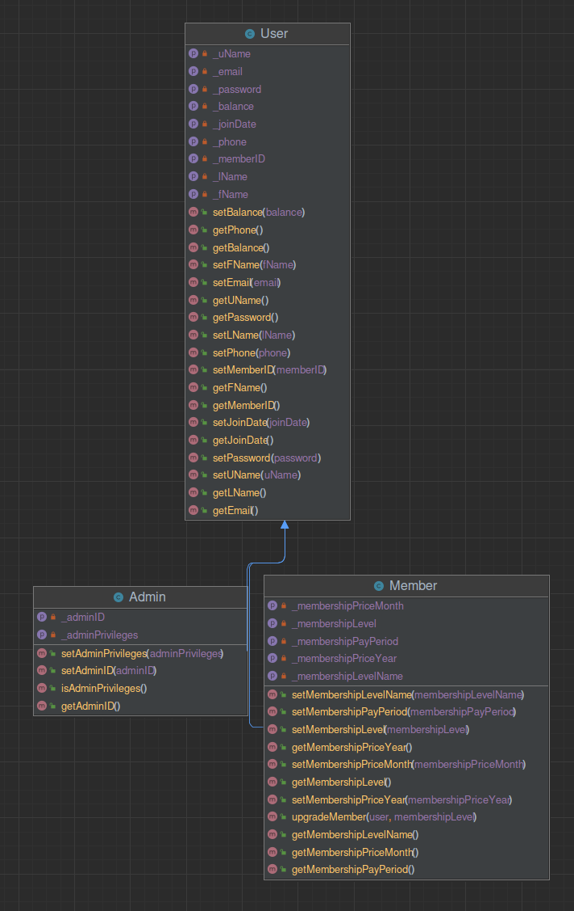

# Globo Gym
### "Because we're better than you, and we know it"

This is the website for Globo Gym, a project for our SDEV328 class at Green River.  It contains a home page, a 
memberships page, an about us page, pages for joining and logging into the website, and an admin page.  This project utilizes 
the PHP Fat Free Framework and MySQL, Bootstrap for client side layout, and jQuery for some form handling on the account page..

### Authors

Jasmine David, Stewart Lovell, and Paul Woods

### Project Requirements and Implementation

1. Separates all database/business logic using the MVC pattern.
   1. Control / Routing is performed inside the /controller/control.php file
   2. Data Validation is done inside the /model/validate.php file
   3. Database Access is done through the /model/data-layer file
   4. View pages (.html f3 templates) are inside the /views folder
2. Routes all URLs and leverages a templating language using the Fat-Free framework.
3. Has a clearly defined database layer using PDO and prepared statements.
  1. The data-layer.php file uses PDO and prepared statements for all database access
4. Data can be added and viewed.
   1. database access (reads/writes/updates) are performed on account creation, login, password 
changes, and account level updates.
5. Has a history of commits from both team members to a Git repository. Commits are clearly commented.
   1. done.
6. Uses OOP, and utilizes multiple classes, including at least one inheritance relationship.
   1. Classes include the User base class, and Admin and Member are subclasses of that
7. Contains full Docblocks for all PHP files and follows PEAR standards.
   1. All (we believe) PHP code is commented, and we attempted to follow PEAR
8. Has full validation on the client side through JavaScript and server side through PHP.
   1. Server side validation is complete
   2. Client/js side validation is less so ... 
9. All code is clean, clear, and well-commented. DRY (Don't Repeat Yourself) is practiced.
10. Your submission shows adequate effort for a final project in a full-stack web development course.
11. BONUS:  Incorporates Ajax that access data from a JSON file, PHP 
script, or API. If you implement Ajax, be sure to include how you did 
so in your readme file.
    1. We used AJAX to allow for the user to udpate their password from the account page. 
    2. It takes in three inputs, current-password, new-password, and verify-new-password.  
    3. When the user clicks on the 'Update Password' button, the 
appropriate msg is displayed depending on the result sent back from the server.
    4. jQuery is used on the client side to read/submit the data using 
a POST method to the specified server URL
    5. (this took a while to figure out) Setup a POST route URL in the 
controller, and that specified function acts as any other.  It works by 
echoing data that is to be returned to the client. i.e. **`echo "{\"data\": \"value\"}`**
    6. This function calls both necessary functions to validate
the input fields and update the database.

### 

### Current UML Diagram

UML Diagram

### Most recent ER database diagram

*insert diagram here*

### Admin Login & Password

There is currently no admin login/password required, the 
page is viewable at <a href="https://paulwoods.greenriverdev.com/328/globo_gym/admin_dashboard"
  target="_blank">admin page</a>